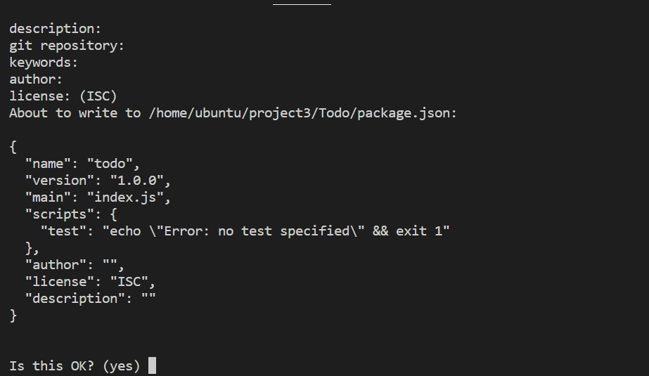
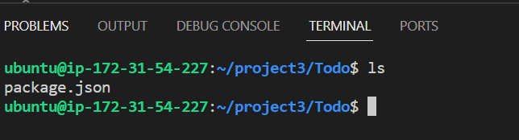

## STEP 1 – BACKEND CONFIGURATION

sudo apt update 
sudo apt upgrade
curl -fsSL https://deb.nodesource.com/setup_18.x | sudo -E bash -
sudo apt-get install -y nodejs
Verify node and npm installation with the following commands
              
              $ node -v 
              $ npm -v 

Create a new directory for your To-Do project and cd into the directory
$ mkdir To-Do

Use this command to initialise your project

     $ npm init
     
     

Run the command ls to confirm that you have package.json file created.

        